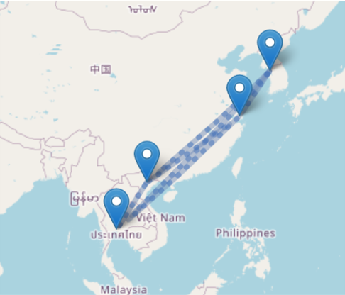
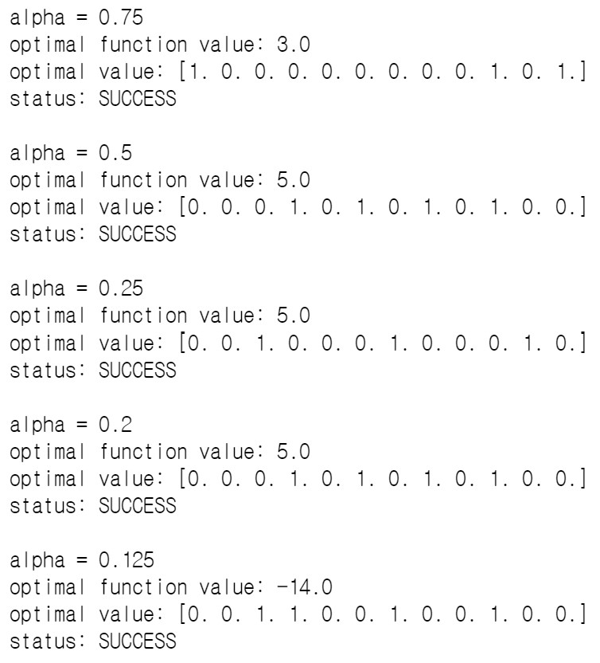
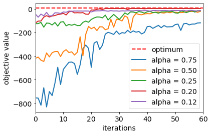

# Qiskit Hackathon Korea 2021 (Feb.16 - Feb.19)
[Issue #8 Design your optimization problem and solve it with Qiskit Optimization](https://github.com/qiskit-community/qiskit-hackathon-korea-21/issues/8)

# SO Group
Special Optimizer group

## Abstract
Qiskit optimization automatically generates an Ising Hamiltonian for an optimization problem and you can solve it with quantum computers by applying VQE or QAOA. Let's come up with a unique optimization problem and solve it with quantum computers.

## Description
Solving an optimization problem with quantum computer requires translating the optimization problem into an Ising Hamiltonian, and then pass the Ising Hamiltonian to a quantum algorithm, such as Variational Quantum Eigensolver (VQE) algorithm and Quantum Approximate Optimization Algorithm (QAOA).
The DOcplex translator can automatically generate Ising Hamiltonians from optimization models. Users just need to write models with DOcplex. Then they can apply VQE or QAOA. The DOcplex translator was introduced recently and we welcome your examples.

References
+ [Qiskit Aqua Optimization tutorial](https://qiskit.org/documentation/tutorials/optimization/index.html)
+ [A Walkthrough of Qiskit’s New Optimization Module](https://medium.com/qiskit/towards-quantum-advantage-for-optimization-with-qiskit-9a564339ef26)
+ [Solving combinatorial optimization problems using QAOA](https://qiskit.org/textbook/ch-applications/qaoa.html)
+ [Circuits for Optimization Problems - Circuit Sessions with Stefan Woerner](https://www.youtube.com/watch?v=LnNaOEqyB7o)
+ [Mathematical Programming Modeling for Python (DOcplex.MP)](http://ibmdecisionoptimization.github.io/docplex-doc/mp/index.html)

### Members
+ [BoSeong Kim](https://github.com/BStar14)
+ [KwangJun Choi](https://github.com/ckj241)
+ [HeeKang Kim](https://github.com/kduke00)
+ [JaeWon Choi](https://github.com/buzri1905)

### Mentor
+ [Takashi Imamichi](https://github.com/t-imamichi)

---

## Delivery Reward Maximization
>__Delivery Reward Maximization (DRM)__ is an optimization problem.
>
>Suppose we should deliver goods to a lot of customers. But you have limited time.
>
>Customers don't wait forever. Then how can you maximize your profit? __DRM__ will give you an answer.

### Modeling DRM
>Let  be the nodes, the customers, and  be your store.
>
>Originally, each customer has a deadline 
>
>But we set a global deadline  instead.
>
>The reward of the each customer is .
>
>Your vehicle's speed is . The edges are the path. Weights of edges  represent distance.
>
>There is also service time  that may represent the time needed to pass the goods.
>
>__DRM__ algorithm requires a massive amount of resources as the dimension increases.
>
>In this project, we consider a particular case called __LDRM (Line Delivery Reward Maximization)__.

### Modeling LDRM
> We modified __LDRM__ a little. Assume that  is at origin and customers were numbered sequentially.
>
> That is, nodes will like this .
>
>We added variables  which represent whether the solution ends at  or not.
>
>Also, set variables , which implies that airplane stop by _j_ th airport whose final destination is _i_.
>
>We added a constraint
>
>
>
>Note that  is 1 if and only if the final destination is _i_.
>
>Then there are _i_ possible airport that airplane can stop by. So when ,  is 0 for all _j_
>
>Otherwise, the airplane can choose the airport before its destination.

---

## Into a real problem
>Suppose the depot is in Incheon. You may deliver your goods by airplane.
>
>Since your goods require a freezing environment, only a few airplanes can carry your goods.
>
>In this case, assume that only one airplane is available. Customers are in Shanghai, Hanoi, and Suvarnabhumi.
>
>Roughly speaking, they are in a line, fortunately. So we can convert this problem into __LDRM__.
>
>

---

## Solution using VQE

### Variables set
>We set a global deadline 
>
>The reward of each  is 
>
>We set all edges and speed are equal
>
>
>
>The service time 
>
>We first choose _i_ to decide on a destination.
>
>The boolean values  denote if we drop by the current point _j_.
>
>Again, _i_ denotes the index of the destination, and _j_ denotes the index of the current point.
>
>We should maximize the cost function
>
>
>
>The exact maximum is 8, when we choose 

### Result
>The first 6 values denotes the 
>
>
>
>For alpha = 0.75 VQE selected only the first node. 
>
>For alpha = 0.5 and 0.2 VQE selected first and third node. 
>
>For alpha = 0.25 VQE selected only the second node. 
>
>For alpha = 0.125 VQE failed to optimize the function.
>
>None of the iterations selected the exact maximum. 
>
>
>
>VQE and QAOA found the correct answer to the simple problems, but not to some of the above.
>
>It seems the problem by nonlinearity or local maxima, which are general issues of the optimizer.

---

## Conclusion
>__NP-Complete__ problems are considered unsolvable even if we have a complete fault-tolerant quantum computer.
>
>It is almost impossible to get the exact solution. However, in most cases, we don't have to find the best.
>
>If an adequately optimized solution is sufficient, we can get such a solution much faster.
>
>Still, with growing variables, classical algorithms also operate too slowly.
>
>In that case, one can expect an optimized solution in a reasonable time with a quantum computation.
>
>The VQE solves the optimization problem by a variational method.
>
>Until now, we cannot compute larger-scale problems due to the lack of quantum volume.
>
>We should continue to improve our methods and develop advanced quantum computers
>
>After then, we would be able to identify quantum singularities also in optimization problems.

---

## Appendix : DRM is NP-Complete
>Suppose there is no weight and the deadline is constantm which is a special case of __DRM__.
>
>Then the problem is reduced to
>
>Maximize 
>
>Subject to
>
>
>
>Remember the knapsack problem. The bag has a limited weight, and you want to maximize the value.
>
>Maximize 
>
>Subject to
>
>
>
>As you can check, two are equivalent. Since the __knapsack problem__ is __NP-Complete__, so is __DRM__.

## Reference
>[1] Chuanwen Luo, Deying Li, Xingjian Ding, Weili Wu. __*Delivery Route Optimization with automated vehicle in smart urban environment*__. Theoretical Computer Science 836(2020). 42-52.
>
>[2] Edward Farhi, Jeffrey Goldstone, Sam Gutmann. __*A Quantum Approximate Optimization Algorithm*__. arXiv:1411.4028.
